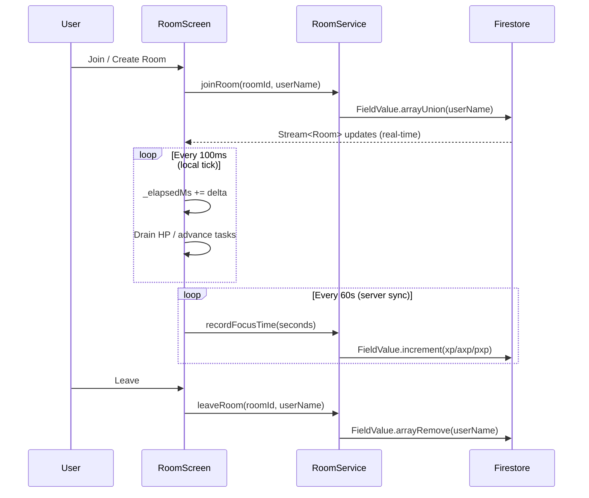
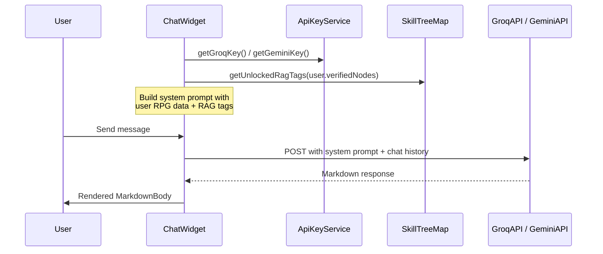

# Career Realm — System Architecture

## Overview

Career Realm follows a **layered clean architecture** pattern inside a single Flutter package.  
All server state lives in Cloud Firestore and is streamed to the UI via `StreamBuilder` and `ChangeNotifier` providers — there is no manual polling.

---

## Layer Diagram

```
┌────────────────────────────────────────────────────────┐
│                     Flutter UI Layer                   │
│  Screens       Widgets       Dialogs / Sheets          │
│  HomeScreen    TimerFace     SoundSheet                │
│  RoomScreen    SkillTree     AvatarSheet               │
│  StatsScreen   AIChat        ThemeSettings             │
└────────────┬───────────────────────────────────────────┘
             │  context.watch / context.read
┌────────────▼───────────────────────────────────────────┐
│                   Provider State Layer                 │
│  AppProvider          ThemeProvider                    │
│  (user, room, auth)   (theme, look, prefs)             │
└────────────┬───────────────────────────────────────────┘
             │  async calls
┌────────────▼───────────────────────────────────────────┐
│                    Service Layer                       │
│  AuthService      RoomService      SoundService        │
│  ApiKeyService    NotificationSvc  AiResumeEngine      │
│  RagProcessor     (future)                             │
└────────────┬───────────────────────────────────────────┘
             │  Firestore SDK / HTTP
┌────────────▼───────────────────────────────────────────┐
│                  Firebase / External APIs              │
│  Firestore       Firebase Auth     Firebase Analytics  │
│  Gemini API      Groq API          (Vertex AI future)  │
└────────────────────────────────────────────────────────┘
```

---

## Data Flow — Focus Room



---

## Data Flow — AI Companion



---

## Module Map

```
lib/
├── main.dart                    # App entry, Firebase init, Provider tree
├── models/
│   └── models.dart              # AppUser, Room, Task, ChatMessage, AiResume, RankSystem
├── providers/
│   ├── app_provider.dart        # Auth, user state, focus time recording
│   └── theme_provider.dart      # Theme, look, timer face, toggleable prefs
├── screens/
│   ├── auth_screen.dart         # Login / sign-up / guest flow
│   ├── home_screen.dart         # Shell: NavRail (desktop) / NavBar (mobile)
│   ├── room_screen.dart         # Focus Realm: timer, HP, chat, tasks, sounds
│   ├── stats_screen.dart        # Dashboard: XP, skill tree, AI resume
│   ├── settings_screen.dart     # Preferences, avatar, API key config
│   ├── fullscreen_timer_screen.dart  # Fullscreen overlay timer
│   └── theme_settings_screen.dart   # Theme + face + look picker
├── services/
│   ├── auth_service.dart        # Firebase Auth (Google, email, guest)
│   ├── room_service.dart        # Firestore room CRUD + presence
│   ├── sound_service.dart       # audioplayers ambient + alert SFX
│   ├── notification_service.dart # flutter_local_notifications
│   ├── api_key_service.dart     # SharedPreferences key manager
│   ├── ai_resume_engine.dart    # RPG → structured resume via Gemini
│   └── rag_document_processor.dart  # (reserved) Vector RAG pipeline
├── widgets/
│   ├── knowledge_architect_chat.dart  # AI chat + 3 persona modes
│   ├── skill_tree_map.dart            # PXP-gated interactive skill tree
│   ├── timer_face_widget.dart         # 10 animated timer styles
│   └── theme_background.dart          # Animated particle backgrounds
└── theme/
    └── app_theme.dart           # Colors, AppStyle tokens, 20 themes, 5 looks
```

---

## State Management

The app uses **Provider** with a two-provider tree:

```dart
MultiProvider(providers: [
  ChangeNotifierProvider(create: (_) => AppProvider()),   // user + room
  ChangeNotifierProvider(create: (_) => ThemeProvider()), // theme + prefs
])
```

`AppProvider` wraps `AuthService` and `RoomService`. It holds a **live `StreamSubscription<AppUser>`** on the Firestore `users/{uid}` document, so XP, streaks, and HP update everywhere in real-time without any manual refresh.

---

## Skill Tree + RAG Integration

```
kSkillTree (List<SkillNode>)
  └─ SkillNode { id, label, emoji, parentId, pxpRequired, ragTags[] }
        │
        ▼
  user.pxp >= pxpRequired  →  isUnlocked = true
                            →  verifiedNodes.add(node.id)
        │
        ▼
  getUnlockedRagTags(user.verifiedNodes)
        │
        ▼
  Injected into Open Source Mentor system prompt
        │
        ▼
  LLM recommends GitHub repos that match those tags
```

### How to Add GitHub Repos to the RAG (Current Approach — No Billing Required)

Since we use the free tier (no Vertex AI vector store), repositories are matched via **keyword injection into the LLM context**:

1. **Curate a Firestore collection** `github_repos` with documents like:
   ```json
   {
     "name": "openai/whisper",
     "description": "Automatic speech recognition",
     "stars": 65000,
     "tags": ["machine learning", "audio", "transformers"],
     "readme_summary": "Whisper is a general-purpose speech recognition model..."
   }
   ```
2. When the user asks for recommendations, the `OpenSourceMentor` calls a `GitHubRepoService.queryByTags(ragTags)` that fetches matching docs and injects them into the prompt as context.
3. The LLM then explains *why* each repo matches the user's skill profile.

### Full Vector RAG (Requires Firebase Blaze / Vertex AI)
See `rag_document_processor.dart` for the Vertex AI embedding pipeline blueprint. Enable when billing is activated.

---

## Timer Logic

| Mode | Behaviour | HP |
|------|-----------|----|
| `DOWN` (countdown) | `_elapsedMs` counts up; display shows `duration - elapsed` | Drains from 100% over focus duration |
| `UP` (unlimited) | `_elapsedMs` counts up freely, no ceiling | Drains over a 60-min reference window |
| Break phase | Always counts DOWN regardless of timerMode | Recovers toward 100% over break duration |

HP fires a bell alert + overlay at 0%. On break end, HP is fully restored and the alert gate is reset.

---

## Security Notes

- API keys (Gemini, Groq) are **never committed to source code**. Users enter them once in Settings; they are stored in device `SharedPreferences`.
- Firebase App Check is configured to prevent unauthorized API access.
- Firestore Security Rules restrict all reads/writes to authenticated users.
